# Machine Learning for Day Trading

## Capstone Project

Please fill out:
* Student name: Arseniy Tyurin
* Student pace: self paced
* Scheduled project review date/time: 11/11/19, 5:00PM (GMT-5)
* Instructor name: Eli Thomas
* Blog post URL: <a href="https://towardsdatascience.com/machine-learning-for-day-trading-27c08274df54" target="_blank">Machine Learning for Day Trading</a>

# Introduction

Day trading is speculation in securities, specifically buying and selling financial instruments within the same trading day, such that all positions are closed before the market closes for the trading day. Traders who trade in this capacity with the motive of profit are therefore speculators.

The project is broken down into 3 sections.
All the steps described here
For detailed information please refer to separate file.

## Fundamentals

### Value of the company:
- Intrinsic value (estimated by future dividends)
- Book value (assets of the company owns)
- Market value (stock on the market)

### Technical Analysis

#### 1. When is technical analysis effective:
- Individual indicators weak
- Combinations stronger
- Look for contrasts (stock vs market)
- Shorter time periods

#### 2. When does technical analysis have value?
- Short periods of time (from milliseconds to days)

#### 3. How to test the model?
- Backtesting

### Efficient Markets Hypothesis

The efficient-market hypothesis (EMH) is a hypothesis in financial economics that states that asset prices reflect all available information. A direct implication is that it is impossible to "beat the market" consistently on a risk-adjusted basis since market prices should only react to new information.

    - Large number of investors
    - New information arrives randomly
    - Prices adjust quickly
    - Prices reflect all available information

### Where does information come from
    - Price/volume
    - Fundamental
    - Exogenous (information about the world that affects stock price)
    - Company insiders

### Types of analysis:
    - fundamental (price is below its value)
    - technical:
        - historical data and volume only
        - compute statistics called indicators (momentum, simple moving average, bollinger bands)
        - indicators are heuristics

# 1. Features Engineering

Data was downloaded from <a href="https://finance.yahoo.com">Yahoo Finance</a> via `pandas datareader`

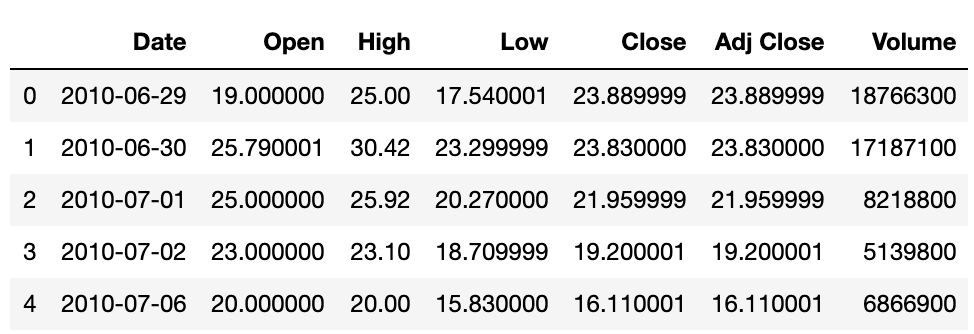

Data provides daily information about stock price and volume.

### Technical Indicators
- **Moving Average** (lagging) analyze whether a market is moving up, down, or sideways over time.
- **Bollinger Bands** (lagging) measure how far a price swing will stretch before a counter impulse triggers a retracement.
- **Relative strength indicators** (leading) measure oscillations in buying and selling pressure.
- **MACD** (leading) evaluate the speed of price change over time.
- **Volume** indicators (leading or lagging) tally up trades and quantify whether bulls or bear are in control.

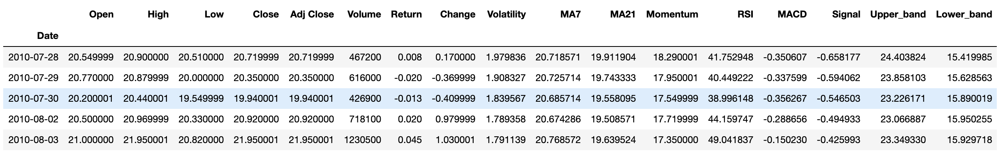

# 2. Exploratory Analysis

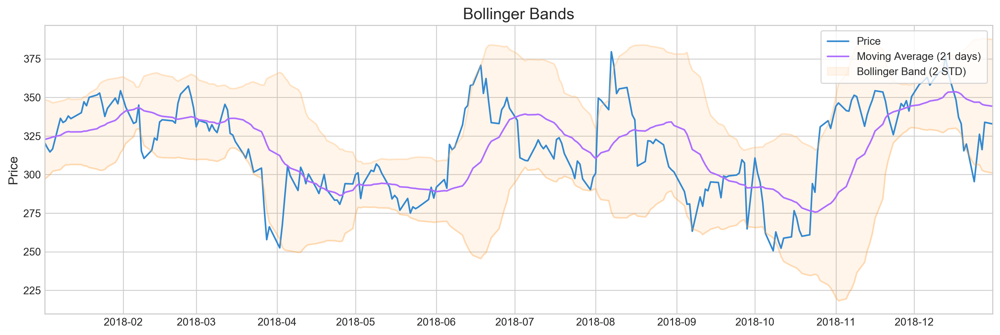
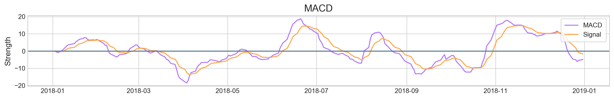
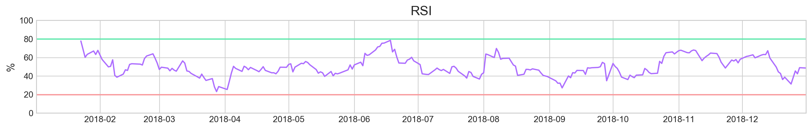

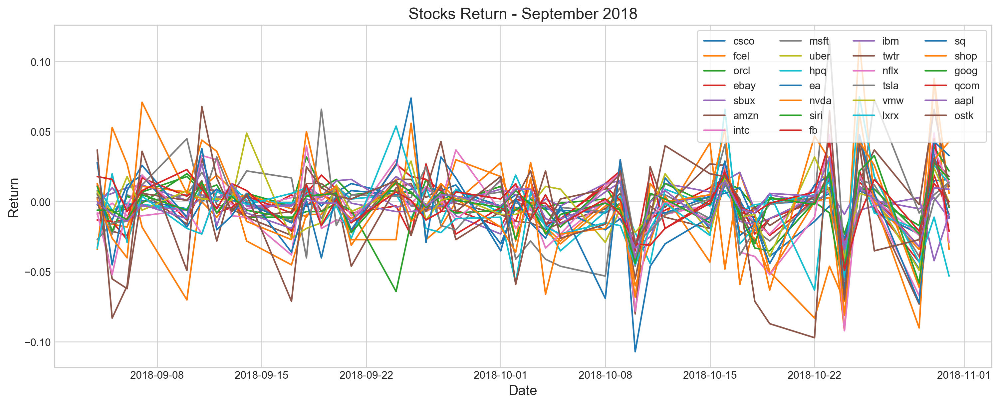

# 3. Machine Learning

## 3.1 Baseline Model

Baseline models is a benchmark for evaluation of more complex models. Baseline model predict next day stock return 

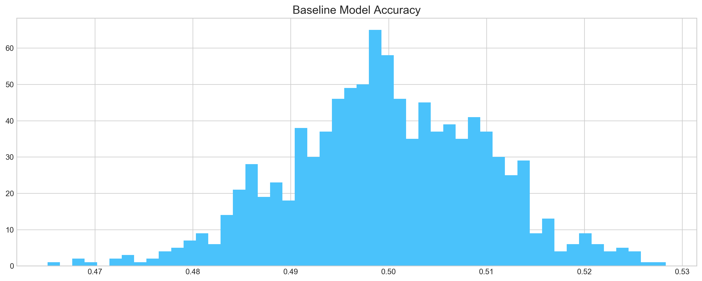

## 3.2 ARIMA

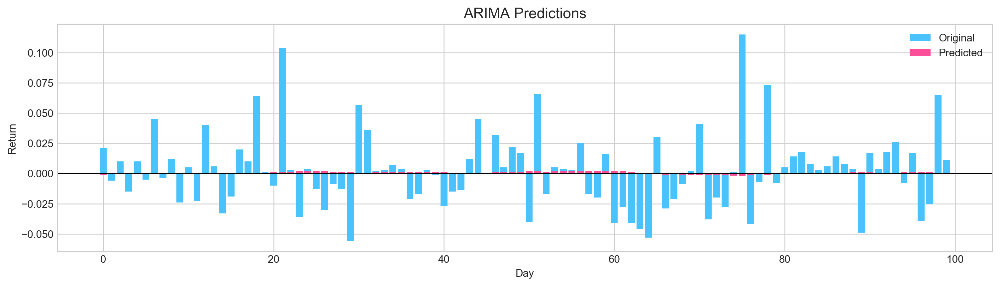

## 3.3 Sentiment Analysis

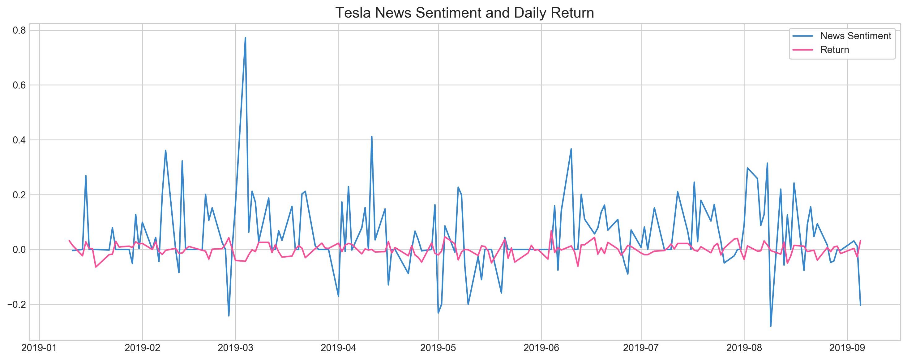

## 3.4 XGBOOST

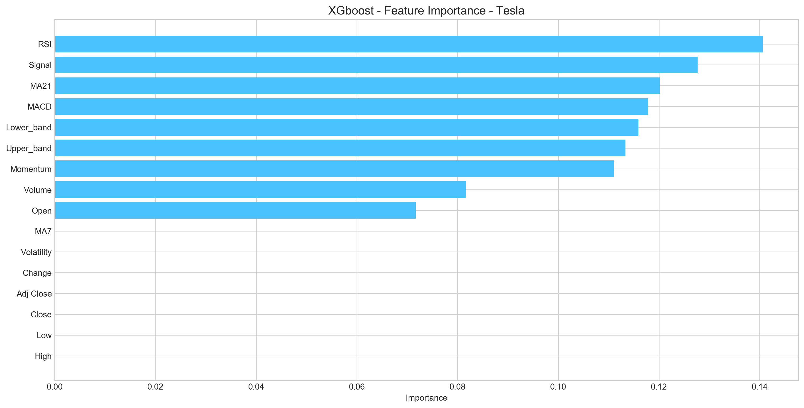

## 3.5.1 LSTM

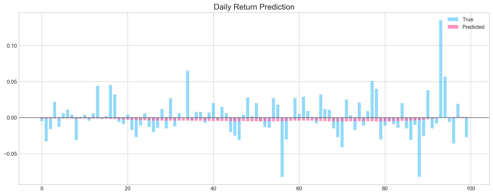

## 3.4.2 Convolutional Neural Network

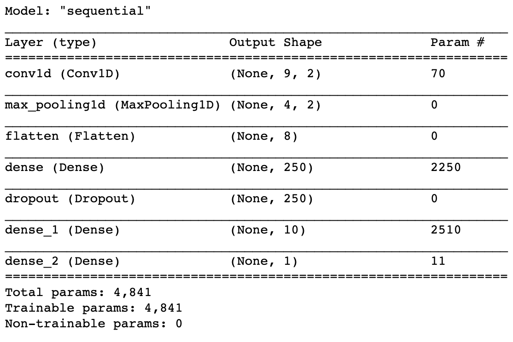
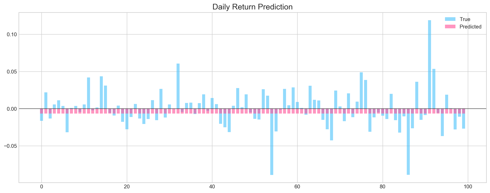

## 3.5.4 18 Stocks

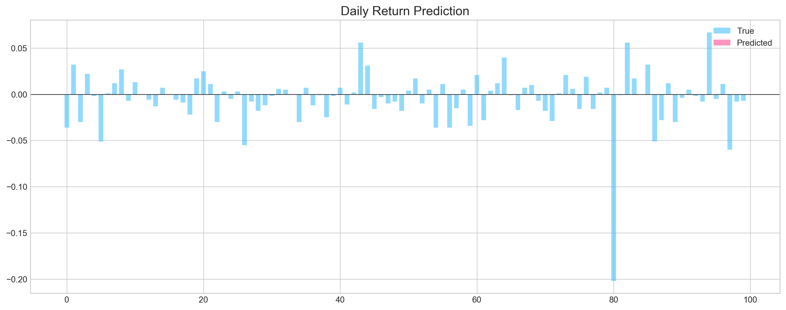

## 3.5.4 Bayesian Optimization

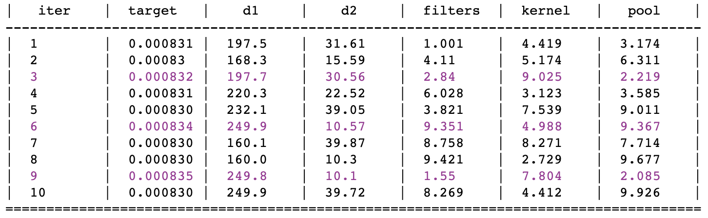

## 3.6 Finding Similar Patterns

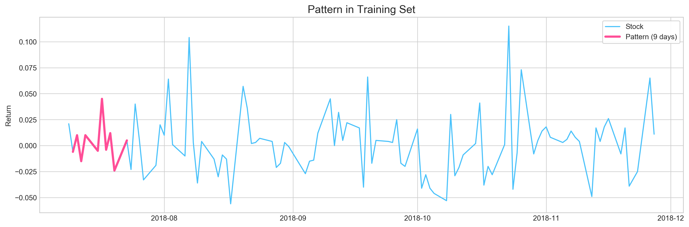
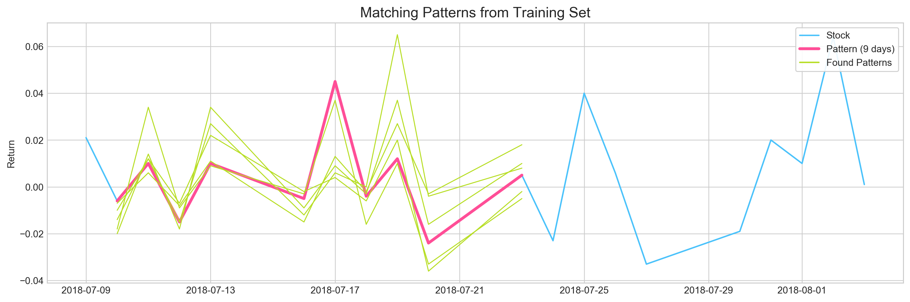

Accuracy 50%

## 3.7 Q-Learning

### 3.7.1 MACD

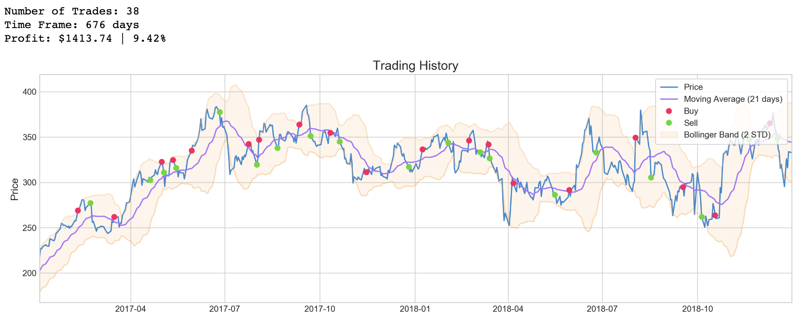
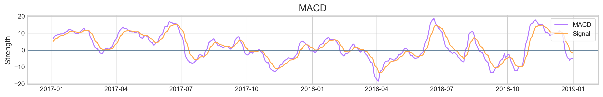

### 3.7.2 Bollinger Bands

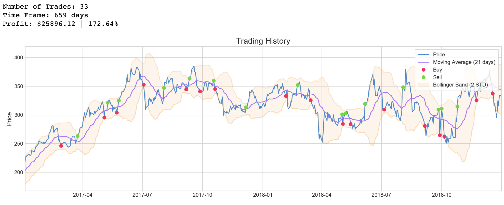

# Conclusion

- ARIMA model can't surpass baseline model accuracy due to the historical data stochastic behaviour.
- Convolutional model prone to overfitting, resulting on very good accuracy on training set, and extremely poor accuracy on testing set.
- Recurrent (LSTM) neural network can't learn from training data, averaging on 50% accuracy both on training and testing data
- Bayesian optimization didn't improve accuracy of convolutional network
- Neural Network architecture and complexity doesn't affect results of the model performance
- Predictions based on matching patterns from testing data with patterns from testing didn't surpass 50% accuracy
- **Q-Learning showed good results for short term investment, especially Bollinger Bands**

# Future Work

- Incorporate fundamental analysis with historical data
- Add recommendations from trading platforms
- Use twitter as a supplement to news data
- Expand analysis to stock from different industries
- Add more rules to swing trading strategy with technical indicators

# References

- [1] <a href="https://www.investopedia.com/articles/basics/04/100804.asp" target="_blank">Forces That Move Stock Prices</a>
- [2] <a href="https://machinelearningmastery.com/how-to-develop-lstm-models-for-time-series-forecasting/" target="_blank">How to Develop LSTM Models for Time Series Forecasting</a>
- [3] <a href="https://www.udacity.com/course/machine-learning-for-trading--ud501">Udacity: Machine Learning for Trading (Free Course)</a>
- [4] <a href="https://www.investopedia.com/articles/technical/081501.asp" target="_blank">Momentum Indicates Stock Price Strength</a>
- [5] <a href="https://people.duke.edu/~rnau/arimrule.htm" target="_blank">Rules for identifying ARIMA models</a>
- [6] <a href="https://www.dlology.com/blog/how-to-do-hyperparameter-search-with-baysian-optimization-for-keras-model/" target="_blank">Bayesian Optimization for Keras Model</a>
